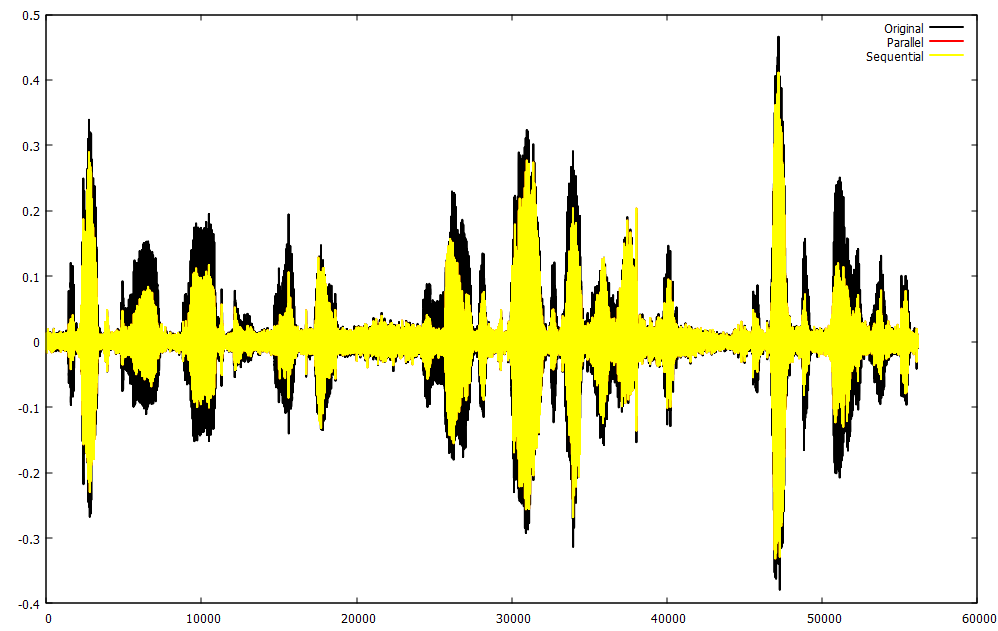
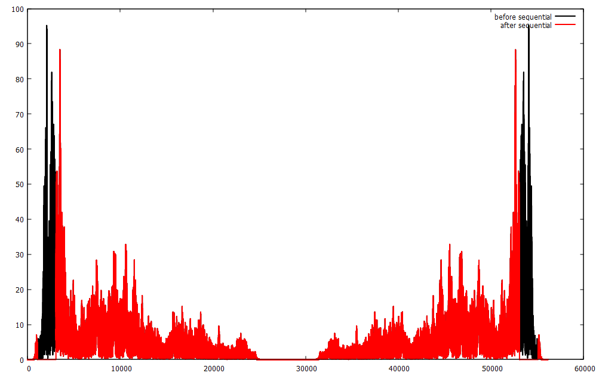

# Шумоподавление аудио через ДПФ + OpenMP

Задача: Считать из файла сигнал. Написать преобразование фурье и опрелить частотные характеристики сигнала. Выделить в сигнале максимальную частоту, вырезать её с некоторой окрестностью и сделать обратное преобразование Фурье
Решение: Файл ParallelLab.cpp

## Что делает программа

1. Читает одномерный сигнал из файла `noisy.txt` (по одному числу на строку);
2. Считает спектр:
   - `direct_fourier` — параллельная версия ДПФ;
   - `direct_fourier_seqly` — последовательная версия;
3. Сохраняет амплитудный спектр до фильтрации;
4. Находит максимальные по амплитуде частоты (с точностью `Eps`) и зануляет их вместе с соседними в радиусе `free_radius` (взят free_radius = 1000, т.к. исходное количество бинов ~50000);
5. Сохраняет амплитудный спектр после фильтрации;
6. Восстанавливает сигнал:
   - `indirect_fourier` — параллельная версия обратного ДПФ;
   - `indirect_fourier_seqly` — последовательная версия;
7. Пишет результаты в текстовые файлы, удобные для построения графиков через gnuplot.

### Выходные файлы

После запуска появляются:

1. Сигналы:
  - `noisy_gnu.txt` — исходный шумный сигнал;
  - `denoised_paral_gnu.txt` — восстановленный после параллельной обработки;
  - `denoised_seq_gnu.txt` — восстановленный после последовательной обработки;
2. Спектр:
  - `spectrum_par_before.txt`, `spectrum_par_after.txt`;
  - `spectrum_seq_before.txt`, `spectrum_seq_after.txt`.

## Пример входных данных

Для теста использован 7-секундный уличный разговор с фоновым шумом.

Подготовка была сделана на Python:

1. Взят WAV-файл длительностью ~7 сек.
2. С помощью Python и модуля soundfile сделано преобазование в последовательность чисел;
3. Результат записан в `noisy.txt`.

В репозитории лежит пример входного WAV и соответствующий `noisy.txt`.

## Метрики спектра

Программа считает три метрики:

- **Max amplitude** — максимальная амплитуда гармоники:  
  \|X[k]\| = sqrt(re² + im²).  
  Показывает доминирующую частоту/шум.
- **Total power** — суммарная мощность спектра:  
  Σ \|X[k]\|².  
  Характеризует «энергию» сигнала в частотной области.
- **Mean power** — средняя мощность на бин:  
  Total power / N.  

## Результаты

### Консольный вывод и производительность

**Параллельная версия**
- `direct_fourier` = **67.480 s**
- `delete_max_freqs` = **0.011 s**
- `indirect_fourier` = **28.084 s**

**Последовательная версия**
- `direct_fourier` = **287.146 s**
- `delete_max_freqs` = **0.034 s**
- `indirect_fourier` = **225.747 s**

**Метрики**
- До обработки:
  - Max amplitude = **95.2113** (бин k=54074)  
  - Total power = **5.30879e+06**
  - Mean power = **94.5532**
- После обработки:
  - Max amplitude = **88.3041** (бин k=52646)
  - Total power = **2.91119e+06**
  - Mean power = **51.8504**

**Выводы:**
- OpenMP даёт ускорение примерно **4.2×** для прямого ДПФ и **8×** для обратного ДПФ на моём CPU.
- После удаления пиков мощность спектра заметно падает:
  - Total power: 5.31e6 → 2.91e6
  - Mean power: 94.55 → 51.85  
  Это означает, что доминирующие шумовые частоты были успешно подавлены.

## Графики

Ниже приложены графики сигналов и спектров.  
Все они строятся из файлов, которые генерирует программа.

### Сигнал во времени

**До и после фильтрации:**



### Амплитудный спектр

**До и после удаления пиков (параллельно):**


**До и после удаления пиков (последовательно):**



## Аудио

### Исходный сигнал

https://github.com/user-attachments/assets/123b951c-726c-4099-9da3-b4373d5c2589

### После фильтрации

https://github.com/user-attachments/assets/952771bb-95c3-4041-8557-5bbcaa99c544

## Сборка и запуск

Запускала:
- g++ с поддержкой OpenMP на Windows 10 (g++ 15.2.0, OpenMP через MSVC 19.29.30154)

Сборка:

```bash
g++ -O2 -fopenmp ParallelLab.cpp -o program.exe
